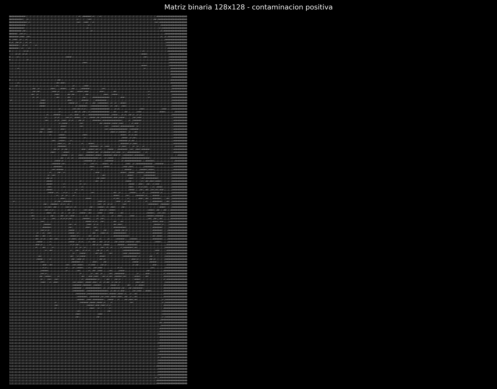
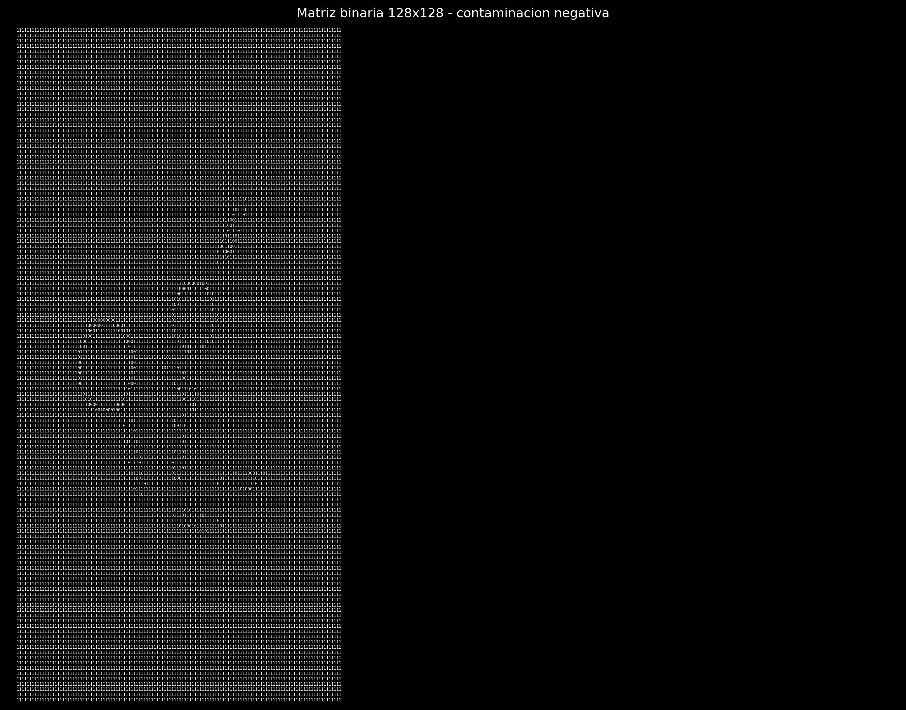

# Clasificación de contaminación en una línea de producción simulada

## Descripción

Este proyecto implementa un sistema de clasificación de imágenes para detectar la presencia de contaminaciones (granos de arroz) en una línea de producción simulada, utilizando técnicas de aprendizaje automático clásico.

El enfoque corresponde a un problema de **clasificación supervisada**, donde cada imagen es transformada a una representación binaria y utilizada para entrenar modelos.

---

## Metodología

El proceso seguido fue:

1. Recolección de imágenes (positivas y negativas)
2. Preprocesamiento:
   - Escala de grises
   - Redimensionamiento a 128×128
   - Binarización (Otsu)
3. Conversión a vectores (16384 características)
4. Construcción del dataset (CSV)
5. Entrenamiento de modelos
6. Evaluación
7. Exportación del modelo

---

## Dataset

El dataset está compuesto por imágenes transformadas a vectores binarios.

Cada fila contiene:

- 16384 valores (imagen 128×128)
- 1 etiqueta:
  - 1 ? presencia de arroz
  - 0 ? ausencia de arroz

Archivo generado:

dataset.csv

---

## Ejemplo de representación

Ejemplo de matriz binaria (imagen procesada):

### Contaminacion positiva

### Contaminacion negativa

---

## Modelos utilizados

Se evaluaron los siguientes modelos:

- Árbol de decisión
- Naive Bayes
- K-Nearest Neighbors (KNN)
- Support Vector Machine (SVM)

El mejor modelo se selecciona según el rendimiento en el conjunto de prueba.

---

## Evaluación

Se utilizaron:

- Accuracy
- Precision, Recall y F1-score
- Matriz de confusión

Esto permite evaluar el desempeño del clasificador en términos de aciertos y errores.

---

## Modelo final

El modelo entrenado se exporta en formato:

C09331_Kenneth_VizcainoJimenez.joblib

Este archivo permite realizar inferencia sobre nuevas imágenes.

---

## Ejecución

Instalar dependencias:

pip install -r requirements.txt

Ejecutar:

python codigo_unificado.py

---

## Conclusión

El modelo logra identificar patrones en las imágenes binarizadas, permitiendo clasificar correctamente la presencia de contaminaciones en la mayoría de los casos.

Sin embargo, su desempeño depende de condiciones como iluminación, fondo y calidad de imagen.
